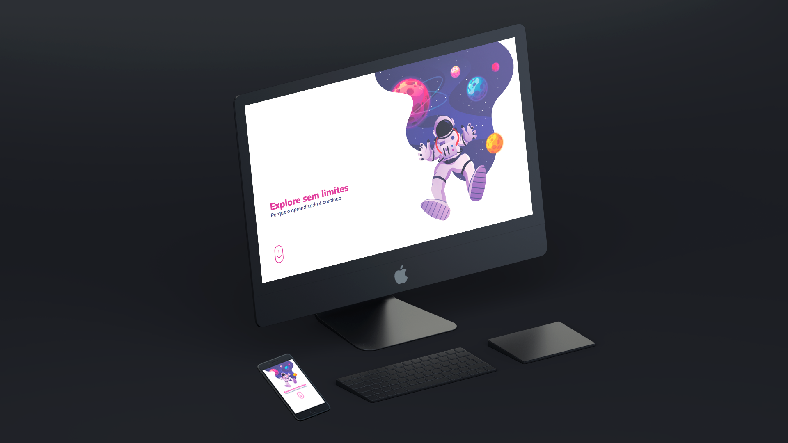

  
  

## 🖥️ Projeto

Esse é um projeto WEB responsivo, proposto pelo desafio do curso Explorer da Rocketseat, utilizando conceitos adquiridos no curso.

## 🚀 Tecnologias

Esse projeto foi desenvolvido durante o curso Explorer da Rocketseat com as seguintes tecnologias:

- HTML
- CSS
- Git e Github

## 💡 Propriedades Utilizadas

- Utilização de medida REM.
- Utilização de Media Queries.
- Utilização de variáveis.
- Utilização de position relative e absolute.
- Utilização de flex reverse.